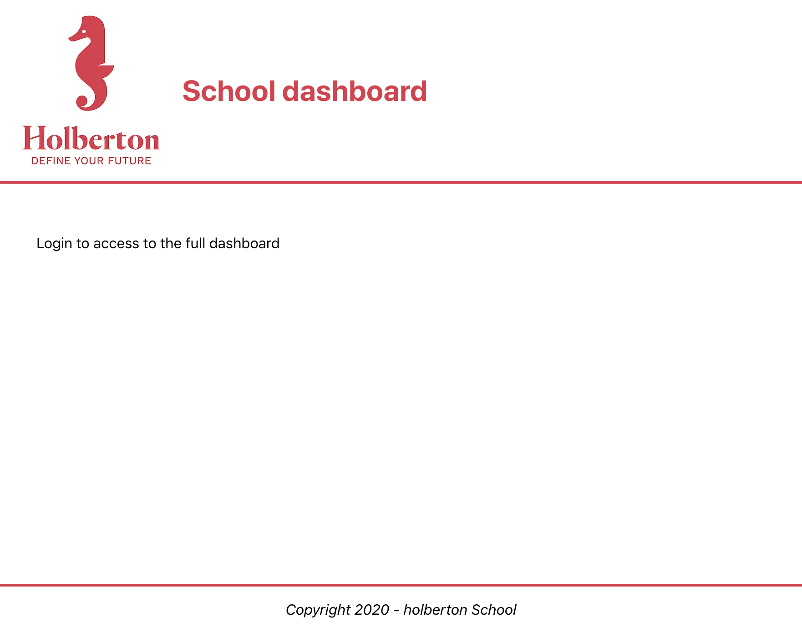

## Resources
### Read or watch:

[React Official Website](https://react.dev/)
[Getting started with React](https://www.taniarascia.com/getting-started-with-react/)
[Quick Start with React](https://react.dev/learn)
[create-react-app](https://github.com/facebook/create-react-app)
[React Developer Tools](https://chromewebstore.google.com/detail/react-developer-tools/fmkadmapgofadopljbjfkapdkoienihi?pli=1)
[What is Babel?](https://babeljs.io/docs/)
[Enzyme](https://enzymejs.github.io/enzyme/docs/api/shallow.html)
## Learning Objectives
At the end of this project, you are expected to be able to explain to anyone, **without the help of Google**:

- How to create a basic Javascript application using React
- How to use the package ```create-react-app``` to start developing quickly with React
- What JSX is and how to use it
- How to use the React Developer Tools to debug your code
- How to use React with Webpack & Babel
- How to use Enzyme’s Shadow rendering to test your application
## Requirements
- All your files will be interpreted/compiled on Ubuntu 18.04 LTS using node ```12.x.x``` and npm ```6.x.x```
- Allowed editors: ```vi```, ```vim```, ```emacs```, ```Visual Studio Code```
- All your files should end with a new line
- A ```README.md``` file, at the root of the folder of the project, is mandatory


# Tasks

### 0. Basic application
```mandatory```
**Create a basic app named** ```dashboard``` **using** ```create-react-app``` **in your** ```task_0``` **directory**

You will need a favicon and the Holberton logo. Download them and add them to the ```src/``` directory under ```dashboard/```

**Holberton Logo**


**Favicon**


Remove the unused files:

- ```service-worker```
- ```index.css```
- ```App.test.js```

**in** ```task_0/dashboard/src/App.js```**, create a function** ```App``` **that returns:**

- a header div with a class named ```App-header``` containing the Holberton logo and a h1 with the text ```School dashboard```
- a body div with a class named ```App-body``` containing at least one paragraph with the text ```Login to access the full dashboard```
- a footer div with a class named ```App-footer``` containing at least one paragraph with the text ```Copyright 2020 - holberton School```

**Modify the App.css to make the project looks like the following screenshot:**




#### Requirements:

- When running, there should not be any lint error in the console

**Repo:**

- GitHub repository: ```alx-react```
- Directory: ```0x01-react_intro```
- File: ```task_0/dashboards/src/```, ```task_0/dashboard/src/App.css```, ```task_0/dashboard/src/App.js```


### 2. Embedding expressions, functions
```mandatory```
**Using your code from the previous task, in** ```task_1/dashboard/src/utils.js```:

- Create a function named ```getFullYear``` that will return the current year
- Create a function named ```getFooterCopy```:
    - It accepts one argument ```isIndex```(boolean). When true, the function should return ```Holberton School```. When false, the function should return ```Holberton School main dashboard```
- Modify the footer returned in ```task_1/dashboard/src/App.js``` to use these two functions

**in** ```task_1/dashboard/src/Notifications.js```, **create a Notifications element**:

- It should import React
- It should export a function
- The function should return a ```div``` with the class ```Notifications```
- The div should contain a paragraph with the text ```Here is the list of notifications```
- import the file ```Notifications.css```.

**in ```task_1/dashboard/src/Notifications.css```, style the Notifications class**:

- Add a border and some padding around the div

**Render the Notifications element:**

- Modify ```task_1/dashboard/src/index.js``` to render the new element (```Notifications```) in a ```div``` named `root-notifications`
- Check that you can see the two elements on the browser, and using the React browser extension

**Requirements:**

- When running, there should not be any lint error in the console

**Repo:**

- GitHub repository: `alx-react`
- Directory: `0x01-react_intro`
- File: `task_1/dashboard/src/`, `task_1/dashboard/src/utils.js`, `task_1/dashboard/src/App.js`, `task_1/dashboard/src/Notifications.css`, `task_1/dashboard/src/Notifications.js`, `task_1/dashboard/src/index.js`
